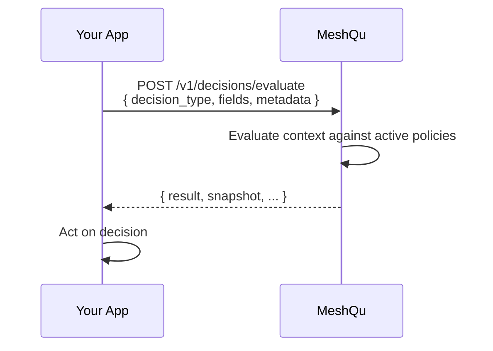

This page introduces the key abstractions you will work with when integrating MeshQu.

## Decision boundary

The **decision boundary** is the moment a system outcome becomes irreversible — execution, settlement, release, or approval. MeshQu is designed to sit at the decision boundary: your application calls it before (or after) that moment and receives a governed verdict.

## Decision context

A **decision context** is the payload you send to MeshQu describing what is about to happen. It contains:

| Field | Description |
| --- | --- |
| `decision_type` | A string identifying the kind of operation (e.g. `trade_execution`, `withdrawal`). |
| `fields` | Domain-agnostic values the policies evaluate (account, amount, instrument, etc.). |
| `metadata` | Optional key-value pairs for traceability (source system, request ID, etc.). |
| `evidence` | Optional supporting data that policies may reference during evaluation (e.g. `credit_report_id`, `sanctions_list_version`). Evidence supports the audit trail but does not drive policy logic. |
| `source_artifact` | Optional cryptographic binding to a source document (hash + metadata). |

## Policy

A **policy** is a named, versioned governance configuration that MeshQu evaluates against incoming decision contexts. Policies have:

- A unique `code` (human-readable identifier).
- An `advisory_mode` flag: when enabled, `DENY` decisions are downgraded to `ALERT` for observation.
- One or more **versions**. Only the active version is used during evaluation.

You manage policies via the API or the MeshQu Console.

### Policy groups

Policies can be organised into **policy groups** for batch management. A decision context may be evaluated against all policies in a group.

## Decision

Every evaluation returns a **decision**:

| Decision | Meaning |
| --- | --- |
| `ALLOW` | All evaluated policies passed. Proceed normally. |
| `REVIEW` | One or more policies flagged the context for manual review. |
| `DENY` | One or more policies rejected the context. |
| `ALERT` | An advisory-mode policy would have denied; logged for observation. |

The decision is **advisory**. Your application decides what to do with it — MeshQu does not block or allow operations on its own.

### Decision receipt

Every evaluation returns a cryptographic receipt that binds the verdict to the exact policy snapshot used:

```json
{
  "decision": "ALLOW",
  "policy_snapshot_id": "11111111-1111-1111-1111-111111111111",
  "policy_snapshot_hash": "2c26b46b68ffc68ff99b453c1d...sha256",
  "integrity_hash": "6f1ed002ab5595859014ebf09...sha256",
  "timestamp": "2025-01-15T10:30:00.000Z"
}
```

The `integrity_hash` covers the context, decision, and snapshot, making the result independently verifiable.

## Conditional rules

Rules can include an optional `when` clause for conditional applicability. A rule with `when` is only evaluated when the clause matches the decision context — otherwise it returns NA (not applicable) and does not affect the outcome. NA rules still appear on the decision receipt, proving the system considered the rule and explaining why it didn't apply. See the [Policy type reference](/docs/gitbook/meshqu-api/types/policy.md#when-clause-conditional-applicability) for supported operators.

## Violation

When a policy does not pass, it produces one or more **violations**. Each violation includes:

- `rule_code` — which rule raised it.
- `reason` — a human-readable explanation.
- `severity` — how serious the violation is.

## Decision (recorded)

A **decision** is a persisted evaluation result. You create one by calling `/v1/decisions/record` with an `idempotency_key`. Recorded decisions support:

- Retrieval by ID or listing with filters.
- Replay for audit verification.
- Linking to alerts.

## Alert

An **alert** is raised when notable conditions are detected (e.g. a critical policy failure). Alerts have a `severity` (`low`, `medium`, `high`, `critical`) and can be acknowledged. You can subscribe to alert webhooks for real-time notification.

## Tenant

All data is isolated per **tenant**. Every API request includes a `X-MeshQu-Tenant-Id` header, and the API key must belong to that tenant.

## Operational guarantees

- Deterministic policy evaluation
- Immutable policy snapshots
- Idempotent decision recording
- Tenant-isolated data
- Replayable audit trail

These are contractual properties of the platform.

## What MeshQu is not

- **Not a rules engine you embed.** MeshQu is a standalone service. Your application calls it over HTTP.
- **Not an execution layer.** MeshQu returns a verdict. It never blocks, allows, or modifies operations on its own.
- **Not a permissions system.** MeshQu does not manage authentication or resource access. Use it alongside your existing IAM.
- **Not a real-time data feed.** MeshQu evaluates the context you send. It does not subscribe to market data or external sources.
- **Not a scoring or risk engine.** MeshQu evaluates decisions against policy. It does not generate risk scores or predictions.
- **Not an explainability tool.** MeshQu proves policy compliance. Model explainability is a separate concern.

### Explicit non-goals

MeshQu intentionally does not:

- Generate risk scores or predictions.
- Subscribe to external data feeds.
- Manage user authentication or authorization.
- Explain upstream model behaviour.

These are out of scope by design, not missing features.

## How auditors use MeshQu

1. Request a decision by ID.
2. Replay the decision against the original policy snapshot.
3. Verify integrity hashes to confirm the verdict has not been altered.
4. Confirm the policy snapshot and timestamp match expectations.

No access to application code or models is required.

## Decision lifecycle

1. **Build context** — your application assembles a decision context (type, fields, metadata, evidence).
2. **Evaluate** — MeshQu evaluates the context against active policies at the decision boundary.
3. **Receive verdict** — MeshQu returns `ALLOW`, `REVIEW`, `DENY`, or `ALERT` with a cryptographic receipt.
4. **Act** — your application enforces the verdict (proceed, queue, or block).
5. **Record** (optional) — persist the evaluation for audit by calling `/v1/decisions/record`.

## Evaluate vs Record

| | **Evaluate** (`/v1/decisions/evaluate`) | **Record** (`/v1/decisions/record`) |
| --- | --- | --- |
| **Persisted** | No — stateless, nothing stored | Yes — context, verdict, and metadata stored |
| **Idempotency key** | Not required | Required |
| **Typical use** | Real-time gating, dry-run testing | Audit trail, compliance evidence |

## Example: blocking a trade and proving it later

1. Order service reaches the **decision boundary**.
2. Application calls `evaluate` with the trade context.
3. MeshQu returns `DENY` with a policy snapshot hash.
4. Application blocks execution and surfaces violations.
5. Decision is recorded with an idempotency key.
6. Six months later, an auditor replays the decision and verifies integrity hashes match.

No application code or model access is required.

## How these fit together



---

**Next:** [API Reference](../api/reference) — full endpoint listing.
