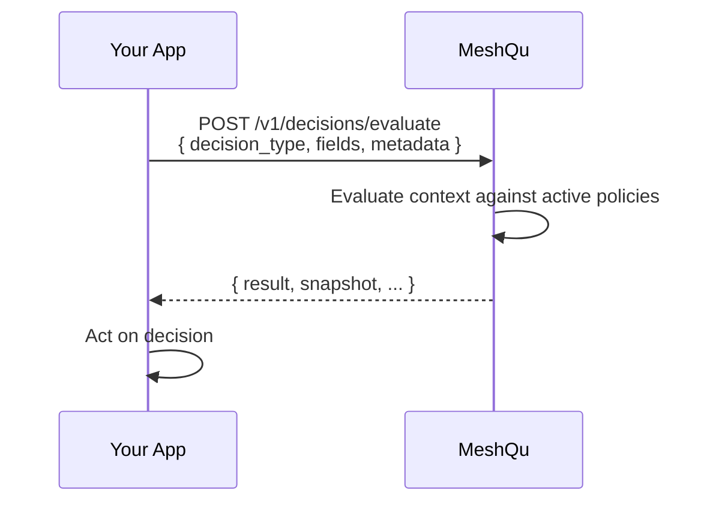

This page introduces the key abstractions you will work with when integrating MeshQu.

## Decision boundary

The **decision boundary** is the moment a system outcome becomes irreversible — execution, settlement, release, or approval. MeshQu is designed to sit at the decision boundary: your application calls it before (or after) that moment and receives a governed verdict.

## Decision context

A **decision context** is the payload you send to MeshQu describing what is about to happen. It contains:

| Field | Description |
| --- | --- |
| `decision_type` | A string identifying the kind of operation (e.g. `trade_execution`, `withdrawal`). |
| `fields` | Domain-agnostic values the policies evaluate (account, amount, instrument, etc.). |
| `metadata` | Optional key-value pairs for traceability (source system, request ID, etc.). |
| `evidence` | Optional supporting data that policies may reference during evaluation (e.g. `credit_report_id`, `sanctions_list_version`). Evidence supports the audit trail but does not drive policy logic. |
| `source_artifact` | Optional cryptographic binding to a source document (hash + metadata). |

## Policy

A **policy** is a named, versioned governance configuration that MeshQu evaluates against incoming decision contexts. Policies have:

- A unique `code` (human-readable identifier).
- An `advisory_mode` flag: when enabled, `DENY` decisions are downgraded to `ALERT` for observation.
- One or more **versions**. Only the active version is used during evaluation.

You manage policies via the API or the MeshQu Console.

### Policy groups

Policies can be organised into **policy groups** for batch management. A decision context may be evaluated against all policies in a group.

## Decision

Every evaluation returns a **decision**:

| Decision | Meaning |
| --- | --- |
| `ALLOW` | All evaluated policies passed. Proceed normally. |
| `REVIEW` | One or more policies flagged the context for manual review. |
| `DENY` | One or more policies rejected the context. |
| `ALERT` | An advisory-mode policy would have denied; logged for observation. |

The decision is **advisory**. Your application decides what to do with it — MeshQu does not block or allow operations on its own.

### Decision receipt

Every evaluation returns a cryptographic receipt that binds the verdict to the exact policy snapshot used:

```json
{
  "decision": "ALLOW",
  "policy_snapshot_id": "11111111-1111-1111-1111-111111111111",
  "evaluated_rules_hash": "2c26b46b68ffc68ff99b453c1d...sha256",
  "integrity_hash": "6f1ed002ab5595859014ebf09...sha256",
  "signature": "base64url-encoded-ed25519-signature",
  "signature_kid": "msk_v1",
  "signature_algorithm": "ed25519",
  "timestamp": "2025-01-15T10:30:00.000Z"
}
```

The `integrity_hash` (SHA-256) covers the context, decision, and snapshot in canonical JSON, making the result independently verifiable. When a signing key is configured, MeshQu signs the integrity hash with **Ed25519**. Auditors can verify receipts using the public key alone — no shared secret is needed. The `signature_kid` identifies which key signed the receipt, supporting key rotation.

## Actor

An **actor** identifies who or what triggered a decision — a human reviewer, an automated system, or a service account. Actors are optional but strongly recommended for workflows where audit trails must name a responsible party.

| Field | Type | Description |
| --- | --- | --- |
| `id` | `string` | Stable identifier for the actor (e.g. user ID, service name). Included in the integrity hash. |
| `type` | `string` | `human` or `system`. |
| `role` | `string` | Functional role (e.g. `analyst`, `compliance_officer`, `screening_service`). |
| `authority` | `string` | Optional. The authority or organisation the actor acts under. |
| `display_name` | `string` | Optional. Human-readable name for audit display. |

<Note>
`actor.id` is the only actor field included in the integrity hash and therefore cryptographically bound to the receipt. Other fields (`type`, `role`, `authority`, `display_name`) are stored for audit display but are not part of the cryptographic proof.
</Note>

See the [Actor Attribution guide](../guides/actor-attribution) for patterns, PII considerations, and trust model details.

## Conditional rules

Rules can include an optional `when` clause for conditional applicability. A rule with `when` is only evaluated when the clause matches the decision context — otherwise it returns NA (not applicable) and does not affect the outcome. NA rules still appear on the decision receipt with a human-readable reason, proving the system considered the rule and explaining why it didn't apply.

**Supported operators:**

| Form | Example | Matches when |
| --- | --- | --- |
| `equals` | `{ "field": "currency", "equals": "USD" }` | Field value is exactly `"USD"`. |
| `in` | `{ "field": "currency", "in": ["USD", "EUR"] }` | Field value is one of the listed values. |
| `exists` | `{ "field": "credit_score", "exists": true }` | Field is present (or absent if `false`). |
| `all` | `{ "all": [clause, clause] }` | All nested clauses match (AND). |
| `any` | `{ "any": [clause, clause] }` | At least one nested clause matches (OR). |

Combinators nest arbitrarily: `{ "all": [{ "field": "region", "in": ["EU", "UK"] }, { "field": "amount", "exists": true }] }`.

See the [API Reference](../api/reference) for the full `when` syntax in policy creation.

## Violation

When a policy does not pass, it produces one or more **violations**. Each violation includes:

- `rule_code` — which rule raised it.
- `reason_code` — a structured code for programmatic aggregation (e.g., `FIELD_MISSING`, `VALUE_ABOVE_MAX`).
- `reason` — a human-readable explanation.
- `severity` — how serious the violation is.

## Decision (recorded)

A **decision** is a persisted evaluation result. You create one by calling `/v1/decisions/record` with an `idempotency_key`. Recorded decisions support:

- Retrieval by ID or listing with filters.
- Replay for audit verification.
- Linking to alerts.
- Grouping into [decision chains](#decision-chain).

## Decision outcome

A **decision outcome** captures what happened after a verdict. For example, a `REVIEW` decision might be `accepted` or `overridden` by a human reviewer.

| Status | Meaning |
| --- | --- |
| `accepted` | Verdict was accepted as-is. |
| `overridden` | Verdict was overridden (includes `final_action`). |
| `escalated` | Referred to a higher authority. |
| `expired` | No action taken within the required window. |
| `abandoned` | Process was abandoned. |

One outcome per decision. Immutable once recorded. Included on individual decision retrieval.

## Decision chain

A **decision chain** is an ordered group of decision receipts that together prove a governed outcome across multiple steps. Chains enable workflow traceability — instead of a bag of individual receipts, a regulator or auditor sees an ordered, parent-linked structure from trigger to outcome.

Each step in a chain is a full cryptographic receipt (integrity hash + Ed25519 signature + optional Rekor anchor). The chain provides queryable grouping and ordering — it does not weaken the proof.

**Key properties:**

- Steps are ordered by `chain_step` (1-based, unique per chain).
- Each step may reference a `parent_decision_id` for causal lineage.
- Chain membership is declared at record time and is immutable.
- Steps can come from automated evaluation or manual form review.
- The verification endpoint checks each receipt's integrity and reports structural warnings (gaps, parent linkage).

**Example: AML workflow**

| Step | Decision type | Verdict | Source |
| --- | --- | --- | --- |
| 1 | Transaction screening | `REVIEW` | Automated |
| 2 | Analyst review | `ALLOW` | Manual form |
| 3 | Final disposition | `ALLOW` | Automated |

Query `GET /v1/decisions?chain_id=...` returns all three steps in order. The verification endpoint confirms each receipt is individually sound.

See the [Decision Chains guide](../guides/decision-chains) for integration patterns and the [API Reference](../api/reference) for endpoint details.

## Alert

An **alert** is raised when notable conditions are detected (e.g. a critical policy failure). Alerts have a `severity` (`low`, `medium`, `high`, `critical`) and can be acknowledged. You can subscribe to alert webhooks for real-time notification.

## Tenant

All data is isolated per **tenant**. Every API request includes a `X-MeshQu-Tenant-Id` header, and the API key must belong to that tenant.

## Operational guarantees

- Deterministic policy evaluation
- Immutable policy snapshots
- Idempotent decision recording
- Tenant-isolated data
- Replayable audit trail

These are contractual properties of the platform.

## What MeshQu is not

- **Not a rules engine you embed.** MeshQu is a standalone service. Your application calls it over HTTP.
- **Not an execution layer.** MeshQu returns a verdict. It never blocks, allows, or modifies operations on its own.
- **Not a permissions system.** MeshQu does not manage authentication or resource access. Use it alongside your existing IAM.
- **Not a real-time data feed.** MeshQu evaluates the context you send. It does not subscribe to market data or external sources.
- **Not a scoring or risk engine.** MeshQu evaluates decisions against policy. It does not generate risk scores or predictions.
- **Not an explainability tool.** MeshQu proves policy compliance. Model explainability is a separate concern.

### Explicit non-goals

MeshQu intentionally does not:

- Generate risk scores or predictions.
- Subscribe to external data feeds.
- Manage user authentication or authorization.
- Explain upstream model behaviour.

These are out of scope by design, not missing features.

## How auditors use MeshQu

1. Request a decision by ID.
2. Replay the decision against the original policy snapshot.
3. Verify integrity hashes to confirm the verdict has not been altered.
4. If the receipt is signed, verify the Ed25519 signature using the public key.
5. Confirm the policy snapshot and timestamp match expectations.

No access to application code or models is required.

## Decision lifecycle

1. **Build context** — your application assembles a decision context (type, fields, metadata, evidence).
2. **Evaluate** — MeshQu evaluates the context against active policies at the decision boundary.
3. **Receive verdict** — MeshQu returns `ALLOW`, `REVIEW`, `DENY`, or `ALERT` with a cryptographic receipt.
4. **Act** — your application enforces the verdict (proceed, queue, or block).
5. **Record** (optional) — persist the evaluation for audit by calling `/v1/decisions/record`.

## Evaluate vs Record

| | **Evaluate** (`/v1/decisions/evaluate`) | **Record** (`/v1/decisions/record`) |
| --- | --- | --- |
| **Persisted** | No — stateless, nothing stored | Yes — context, verdict, and metadata stored |
| **Idempotency key** | Not required | Required |
| **Typical use** | Real-time gating, dry-run testing | Audit trail, compliance evidence |

## Example: blocking a trade and proving it later

1. Order service reaches the **decision boundary**.
2. Application calls `evaluate` with the trade context.
3. MeshQu returns `DENY` with a policy snapshot hash.
4. Application blocks execution and surfaces violations.
5. Decision is recorded with an idempotency key.
6. Six months later, an auditor replays the decision and verifies integrity hashes match.

No application code or model access is required.

## How these fit together


```mermaid
sequenceDiagram
    participant App as Your App
    participant MQ as MeshQu
    App->>MQ: POST /v1/decisions/evaluate<br/>{ decision_type, fields, metadata }
    MQ->>MQ: Evaluate context against active policies
    MQ-->>App: { result, snapshot, ... }
    App->>App: Act on decision
```

---

**Next:** [API Reference](../api/reference) — full endpoint listing.
