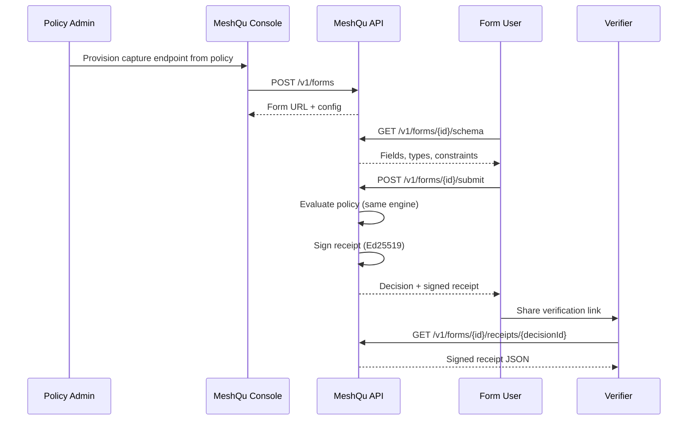
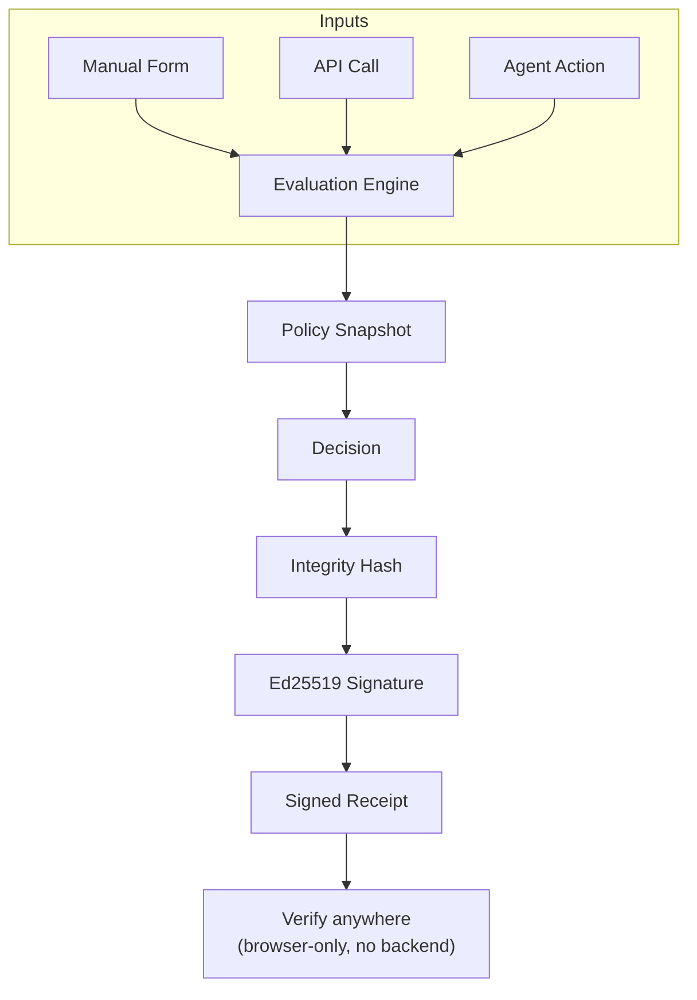
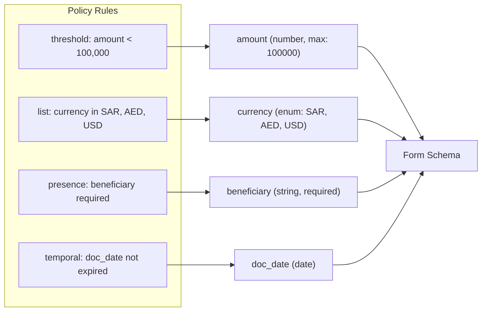
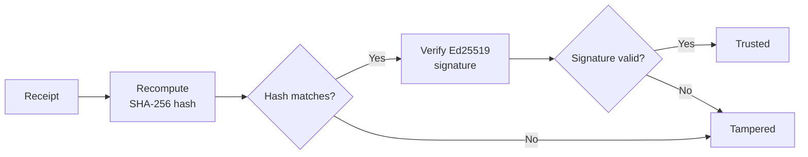

Human Decision Capture extends MeshQu's decision boundary to human-operated workflows. Instead of integrating an upstream system first, teams can expose a policy-derived capture endpoint, submit structured context manually, and receive the same cryptographically signed receipt produced by API-driven evaluation.

---

## Architectural model



The capture endpoint, API integrations, and any future agent all evaluate against the same policy and produce the same receipt format.

---

## Key principle: same engine, same receipt

Manual form submissions go through the exact same evaluation path as API calls:



A receipt from a manual form is cryptographically identical to one from the API. Same hash, same signature, same verification path.

---

## Provisioning a capture endpoint

A capture endpoint is provisioned from an existing policy. Provisioning can be automated via API:

```bash
curl -X POST https://api.meshqu.com/v1/forms \
  -H "Authorization: Bearer $MESHQU_API_KEY" \
  -H "X-MeshQu-Tenant-Id: $TENANT_ID" \
  -H "Content-Type: application/json" \
  -d '{
    "policy_id": "11111111-1111-4111-8111-111111111111",
    "access_mode": "open",
    "is_published": true,
    "branding": {
      "label": "Payment Threshold Check",
      "description": "Submit payment details for compliance review"
    }
  }'
```

The response includes `form_id`. The public capture URL is `/forms/{form_id}`.

---

## Access control modes

Each endpoint supports explicit access control:

| Mode | How it works | Use case |
| --- | --- | --- |
| `open` | No credential required, rate-limited | Controlled public intake |
| `token` | URL token with expiry and max uses | Time-bound external submission |
| `password` | Shared password (hashed server-side) | Team-managed shared access |
| `console` | Console-authenticated access | Internal operator workflows |

Access control is enforced consistently across schema, submit, and API contract endpoints.

---

## Policy-derived schema surface

MeshQu derives the input schema directly from policy rules:



| Rule type | Field type | Constraints |
| --- | --- | --- |
| `threshold` | `number` | `min`, `max` |
| `temporal` | `date` | expiry checks |
| `list` | `enum` or `string` | `allowed_values`, `forbidden_values` |
| `presence` | `string` | `required`, `min_length` |

Retrieve the generated schema:

```bash
curl https://api.meshqu.com/v1/forms/{formId}/schema
```

```json
{
  "fields": [
    {
      "name": "fields.amount",
      "label": "Amount",
      "type": "number",
      "required": true,
      "constraints": { "max": 100000 }
    },
    {
      "name": "fields.currency",
      "label": "Currency",
      "type": "enum",
      "required": true,
      "constraints": { "allowed_values": ["SAR", "AED", "USD"] }
    }
  ],
  "policy_name": "Payment Threshold Check",
  "policy_version": 3,
  "decision_type": "payment_approval",
  "access_mode": "open"
}
```

---

## Evaluation ingress

Submit structured field values for evaluation:

```bash
curl -X POST https://api.meshqu.com/v1/forms/{formId}/submit \
  -H "Content-Type: application/json" \
  -d '{
    "fields": {
      "fields.amount": 75000,
      "fields.currency": "SAR",
      "fields.beneficiary_name": "Acme Corp"
    }
  }'
```

The response is a signed receipt:

```json
{
  "decision_id": "dddddddd-dddd-4ddd-8ddd-dddddddddddd",
  "result": {
    "decision": "ALLOW",
    "violations": [],
    "rules_evaluated": 4,
    "evaluation_time_ms": 1.8,
    "timestamp": "2026-02-17T10:00:00.000Z",
    "integrity_hash": "sha256...",
    "signature": "base64url...",
    "signature_kid": "msk_v1"
  },
  "verification_url": "/v1/forms/{formId}/receipts/{decisionId}"
}
```

---

## Receipts and verification

Every form submission produces a receipt that can be independently verified.

### Fetch a receipt

```bash
curl https://api.meshqu.com/v1/forms/{formId}/receipts/{decisionId}
```

Returns the evaluation context and signed result. The receipt is self-verifying: recompute the integrity hash and verify the Ed25519 signature against MeshQu's public key.

### Verification chain



Public keys are available at `GET /v1/.well-known/signing-keys`. Verification requires no API key or backend access.

---

## Frozen policy versions

By default, forms evaluate against the latest active policy version. To lock a form to a specific version:

```bash
curl -X POST https://api.meshqu.com/v1/forms \
  -H "Authorization: Bearer $MESHQU_API_KEY" \
  -H "X-MeshQu-Tenant-Id: $TENANT_ID" \
  -H "Content-Type: application/json" \
  -d '{
    "policy_id": "11111111-1111-4111-8111-111111111111",
    "policy_version": 3,
    "is_published": true
  }'
```

When `policy_version` is set, the form is **frozen**: it always evaluates against version 3, even if the policy has been updated to version 4+. The form schema, API contract, and evaluation all use the pinned version.

---

## API contract continuity

Each endpoint exposes a developer-ready API contract derived from the same policy. This preserves a clean path from manual capture to system integration without changing governance semantics.

```bash
curl https://api.meshqu.com/v1/forms/{formId}/api-contract
```

Returns:

| Output | Description |
| --- | --- |
| `json_schema` | JSON Schema 2020-12 for the policy's field structure |
| `openapi_snippet` | OpenAPI 3.1 path definition for the evaluate endpoint |
| `curl_example` | Ready-to-run curl command |
| `sdk_examples` | JavaScript and Python code snippets |

These artifacts allow downstream services to move from human capture to direct API evaluation while retaining the same policy model.

---

## Rate limiting

Form endpoints have per-form rate limits to prevent abuse:

| Endpoint | Limit |
| --- | --- |
| Submit (`POST /v1/forms/{id}/submit`) | 100 requests/minute per form |
| Receipt (`GET /v1/forms/{id}/receipts/{id}`) | 300 requests/minute per form |

Global IP-based and tenant-based rate limits also apply as defense-in-depth.

---

## Security summary

- **Tenant isolation**: Forms are tenant-scoped and isolated from other tenants
- **Password hashing**: SHA-256, validated with constant-time comparison
- **Token validation**: Constant-time comparison, configurable expiry and max uses
- **Console auth**: Console-only forms require authenticated console access
- **No document storage**: Only the document hash is included in the receipt (if provided)

---

**Next:** [Integration Patterns](../guides/integration-patterns) to see how manual checks fit alongside API and agent-based evaluation.
