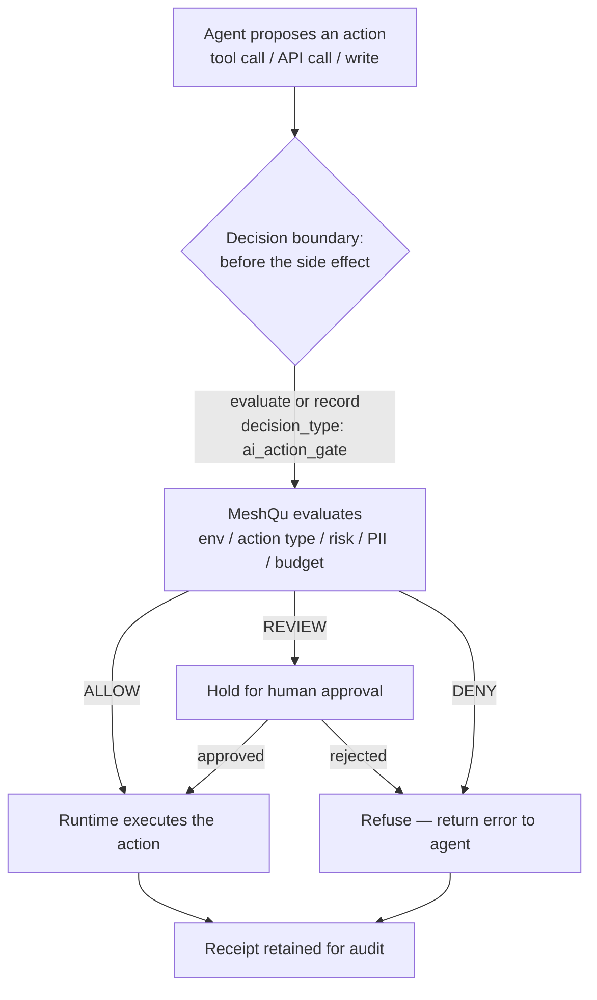

**Audience:** engineers running autonomous or AI-assisted agents (LLM tool-callers, RPA bots, copilots) in regulated or sensitive environments who need a policy gate in front of consequential actions — and a tamper-evident record of what was authorized, denied, or sent for human approval.

This recipe is a concrete instance of the synchronous pre-execution pattern in [Integration Patterns](/guides/integration-patterns). The novelty here is *what* you put in the decision context: not a transaction, but a **proposed agent action**.

## The scenario

Your agent decides it wants to do something — run a database query, write a file, call an external API, export a record, spend tokens. Before it actually performs the action, you intercept it at the **decision boundary** and ask MeshQu: *is this action allowed under our agent-governance policy?*

The policy checks things like:

- The action declares a target **environment** and **action type** (no unscoped actions).
- The action's **risk score** is within limits — high risk routes to human approval, critical risk is denied outright.
- The action does not **export PII** without an audit justification.
- External API calls and resource scopes are declared and within budget.

MeshQu returns a verdict; your agent runtime acts on it.

> **Mental model:** MeshQu is the gate, not the guard. It tells your runtime `ALLOW` / `REVIEW` / `DENY`. Your runtime is what actually lets the tool call through, holds it for a human, or refuses it. A receipt is produced either way.

<Warning>
  MeshQu does not intercept your agent's tool calls for you. **You** call MeshQu before executing the action and **you** enforce the verdict. A `DENY` is a signal — your runtime must be the thing that declines to run the tool.
</Warning>

## Decision boundary



The agent never reaches `EXEC` without passing through `MeshQu evaluates`. Your runtime owns `EXEC`, `HOLD`, and `REFUSE`.

## Gate a low-risk action with `evaluate`

For the hot path — gating thousands of routine tool calls — use **`evaluate`**. It is stateless and stores nothing, so it is cheap to call on every action. Persist only the consequential ones with `record` (next section).

<CodeGroup>

```bash cURL
curl -X POST https://api.meshqu.com/v1/decisions/evaluate \
  -H "Authorization: Bearer mqu_YOUR_API_KEY" \
  -H "X-MeshQu-Tenant-Id: YOUR_TENANT_ID" \
  -H "Content-Type: application/json" \
  -d '{
    "context": {
      "decision_type": "ai_action_gate",
      "fields": {
        "environment": "sandbox",
        "action_type": "database_query",
        "risk_score": 10,
        "resource_scope": "read_only",
        "pii_flagged": false,
        "token_cost_estimate": 1200
      }
    }
  }'
```

```typescript TypeScript
import { MeshQuClient } from '@meshqu/client';

const meshqu = new MeshQuClient({
  baseUrl: 'https://api.meshqu.com',
  tenantId: process.env.MESHQU_TENANT_ID!,
  apiKey: process.env.MESHQU_API_KEY!,
});

// Wrap your agent's tool dispatcher.
async function gateAction(action: ProposedAction): Promise<'run' | 'hold' | 'refuse'> {
  const { result } = await meshqu.evaluate({
    decision_type: 'ai_action_gate',
    fields: {
      environment: action.environment,        // e.g. 'sandbox' | 'production'
      action_type: action.type,               // e.g. 'database_query' | 'file_write'
      risk_score: action.riskScore,           // > 70 → REVIEW, > 90 → DENY
      resource_scope: action.resourceScope,
      pii_flagged: action.touchesPii,
      token_cost_estimate: action.tokenEstimate,
    },
    metadata: { agent_run_id: action.runId },
  });

  switch (result.decision) {
    case 'ALLOW':  return 'run';
    case 'REVIEW': return 'hold';   // your runtime queues for a human
    case 'DENY':   return 'refuse'; // your runtime returns an error to the agent
    case 'ALERT':  return 'run';    // advisory only — log and proceed
  }
}
```

</CodeGroup>

The response includes `result.decision` and a `violations` array explaining *why* — e.g. a missing `environment` field or a `risk_score` over the threshold. Feed the violation `reason` back to the agent so it can adjust or surface it to the operator.

## Record a consequential action with `record`

For actions you must be able to prove later — a production write, a PII access, anything an auditor will ask about — use **`record`**. It evaluates *and* persists a signed receipt, and naming the agent in `actor` (with `type: "automated"`) binds *which agent* requested the action into the receipt.

```typescript TypeScript
const decision = await meshqu.record(
  {
    decision_type: 'ai_action_gate',
    fields: {
      environment: 'production',
      action_type: 'external_api_call',
      api_endpoint: 'https://partner.example.com/v1/orders',
      risk_score: 65,
      resource_scope: 'orders:write',
      pii_flagged: false,
    },
    metadata: { agent_run_id: action.runId, model: 'opus' },
  },
  {
    idempotency_key: `agent-action-${action.id}`,
    actor: { id: 'procurement-agent', type: 'automated', role: 'purchasing_copilot' },
  },
);

if (decision.decision.decision !== 'ALLOW') {
  // Surface the verdict to your runtime — do not execute the action.
  return refuse(decision.decision.result.violations);
}
await executeAction(action); // your runtime performs the side effect
```

The `idempotency_key` makes a retried gate call safe — if the agent retries the same action, you get the original receipt back (`is_new: false`) instead of a second authorization. See [Idempotency](/guides/idempotency).

## Closing the loop on a held action

When a `REVIEW` action is approved or rejected by a human, record what happened with a [decision outcome](/concepts/overview#decision-outcome) so the audit trail shows not just the verdict but the human resolution:

```bash
curl -X POST https://api.meshqu.com/v1/decisions/DECISION_ID/outcome \
  -H "Authorization: Bearer mqu_YOUR_API_KEY" \
  -H "X-MeshQu-Tenant-Id: YOUR_TENANT_ID" \
  -H "Content-Type: application/json" \
  -d '{
    "status": "accepted",
    "source_type": "human",
    "reported_by": "ops-oncall-3",
    "resolution_reason": "Reviewed agent rationale; approved the production API call."
  }'
```

## Operational notes

- **Roll out a new agent rule safely** — start it in `shadow_mode`. The engine evaluates it and surfaces what it *would* have denied as `ALERT`, but the verdict your runtime reads stays unaffected until you promote it. Essential when you cannot afford to wrongly block an agent mid-run. See [Shadow Mode](/guides/shadow-mode).
- **Fail-closed for production actions** — if MeshQu is unreachable, a high-stakes agent action should default to refuse, not run. See the fail-open vs fail-closed guidance in [Integration Patterns](/guides/integration-patterns#fail-open-vs-fail-closed).
- **Page on critical denials** — subscribe a [webhook](/guides/webhooks) filtered to `ai_action_gate` at `severity_min: critical` to alert when an agent attempts a critical-risk or PII-export action.

## Concept references

- [Integration Patterns](/guides/integration-patterns) — the synchronous pre-execution gate, and fail-open vs fail-closed.
- [Core Concepts — Evaluate vs Record](/concepts/overview#evaluate-vs-record) — when to use the stateless gate vs the persisted one.
- [Decision Assurance](/concepts/decision-assurance) — what the receipt proves about a recorded agent authorization.
- [Actor Attribution](/guides/actor-attribution) — binding the agent identity into the receipt.
- [Shadow Mode](/guides/shadow-mode) · [Webhooks](/guides/webhooks).
