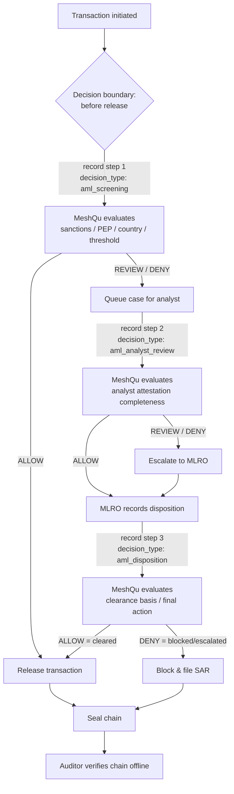

**Audience:** engineers at banks, payment firms, or fintechs building an anti-money-laundering (AML) case workflow who need to prove, after the fact, that each transaction was screened, reviewed by a named analyst, and dispositioned under the policy that was live at the time.

This recipe is a concrete instance of the patterns in [Integration Patterns](/guides/integration-patterns) and [Decision Chains](/guides/decision-chains). Read those for the general mechanics; this page shows how they fit together for an AML case.

## The scenario

A counterparty initiates a transaction. Your AML pipeline runs three steps:

1. **Automated screening** — match the entity against sanctions and PEP lists, country risk, and a reporting threshold. Most cases clear here.
2. **Analyst review** — when screening flags something (or for a sampled subset), a human analyst attests a risk assessment, evidence summary, and recommendation.
3. **Final disposition** — a compliance officer (e.g. an MLRO) records the clearance basis and final action: cleared, blocked, or escalated.

Each step is recorded as a step in one **decision chain**, parent-linked in causal order. When the case closes you **seal** the chain — proving it is complete and no step was added or removed afterwards — and any regulator can later **verify** every receipt offline.

> **Mental model:** MeshQu does not run your AML pipeline. Your system orchestrates the three steps and decides what to do at each verdict. MeshQu governs each decision against your policy and binds the sequence into a tamper-evident, replayable chain.

<Warning>
  MeshQu is advisory. It returns a verdict per step — your system blocks, queues, or releases the transaction. A `DENY` on the screening step does not stop the money on its own; your payment rail does, after reading the verdict.
</Warning>

## Decision boundary



Your code owns every box that acts — release, queue, escalate, block. MeshQu owns the `MeshQu evaluates` boxes and the seal/verify proof.

## Step 1 — Automated screening

Record the screening decision as step 1 of a new chain. Generate a `chain_id` (any UUID) for the case and reuse it across all three steps.

<CodeGroup>

```bash cURL
curl -X POST https://api.meshqu.com/v1/decisions/record \
  -H "Authorization: Bearer mqu_YOUR_API_KEY" \
  -H "X-MeshQu-Tenant-Id: YOUR_TENANT_ID" \
  -H "Content-Type: application/json" \
  -d '{
    "context": {
      "decision_type": "aml_screening",
      "fields": {
        "case_reference": "AML-2026-00481",
        "entity_name": "Meridian Trade Corp",
        "country": "GB",
        "transaction_amount": 25000,
        "sanctions_match": "none",
        "pep_match": "none"
      }
    },
    "actor": { "id": "screening-service", "type": "automated", "role": "sanctions_screening" },
    "options": {
      "idempotency_key": "aml-2026-00481-screening",
      "chain": { "chain_id": "b3f1c2a0-1111-4a2b-9c3d-000000000001", "chain_step": 1 }
    }
  }'
```

```typescript TypeScript
import { MeshQuClient } from '@meshqu/client';
import { randomUUID } from 'crypto';

const meshqu = new MeshQuClient({
  baseUrl: 'https://api.meshqu.com',
  tenantId: process.env.MESHQU_TENANT_ID!,
  apiKey: process.env.MESHQU_API_KEY!,
});

const chainId = randomUUID(); // one id for the whole case

const screening = await meshqu.record(
  {
    decision_type: 'aml_screening',
    fields: {
      case_reference: 'AML-2026-00481',
      entity_name: 'Meridian Trade Corp',
      country: 'GB',
      transaction_amount: 25000,
      sanctions_match: 'none',
      pep_match: 'none',
    },
  },
  {
    idempotency_key: `${chainId}-screening`,
    actor: { id: 'screening-service', type: 'automated', role: 'sanctions_screening' },
    chain: { chain_id: chainId, chain_step: 1 },
  },
);

switch (screening.decision.decision) {
  case 'ALLOW':
    await releaseTransaction();      // your system acts
    break;
  case 'REVIEW':
  case 'DENY':
    await queueForAnalyst(chainId, screening.decision.id);
    break;
}
```

</CodeGroup>

A clean screening returns `decision: "ALLOW"` with an empty `violations` array. A sanctions or PEP hit returns `DENY` (critical severity); a high-value transaction over the reporting threshold returns `REVIEW`. The full response carries the `integrity_hash`, Ed25519 `signature`, and `chain_step` — see [Decision Assurance](/concepts/decision-assurance) for what each proves.

## Step 2 — Analyst review

When step 1 routes to a human, the analyst submits their attestation. Record it as step 2, linking back to step 1 with `parent_decision_id`. The review policy enforces that the attestation is **complete** — a too-short risk assessment or a missing recommendation is a violation, so an analyst cannot wave a case through with an empty form.

<CodeGroup>

```bash cURL
curl -X POST https://api.meshqu.com/v1/decisions/record \
  -H "Authorization: Bearer mqu_YOUR_API_KEY" \
  -H "X-MeshQu-Tenant-Id: YOUR_TENANT_ID" \
  -H "Content-Type: application/json" \
  -d '{
    "context": {
      "decision_type": "aml_analyst_review",
      "fields": {
        "risk_assessment": "Established UK entity, clean screening, no PEP associations. Amount within normal range for the entity profile.",
        "evidence_summary": "Companies House registration verified. No adverse media. Bank reference letter on file.",
        "recommendation": "approve",
        "risk_score": 25
      }
    },
    "actor": { "id": "analyst-7741", "type": "human", "role": "compliance_analyst", "display_name": "J. Okafor" },
    "options": {
      "idempotency_key": "aml-2026-00481-review",
      "chain": {
        "chain_id": "b3f1c2a0-1111-4a2b-9c3d-000000000001",
        "chain_step": 2,
        "parent_decision_id": "STEP_1_DECISION_ID"
      }
    }
  }'
```

```typescript TypeScript
const review = await meshqu.record(
  {
    decision_type: 'aml_analyst_review',
    fields: {
      risk_assessment:
        'Established UK entity, clean screening, no PEP associations. Amount within normal range for the entity profile.',
      evidence_summary:
        'Companies House registration verified. No adverse media. Bank reference letter on file.',
      recommendation: 'approve', // 'escalate' → REVIEW, 'reject' → DENY
      risk_score: 25,
    },
  },
  {
    idempotency_key: `${chainId}-review`,
    actor: { id: 'analyst-7741', type: 'human', role: 'compliance_analyst', display_name: 'J. Okafor' },
    chain: { chain_id: chainId, chain_step: 2, parent_decision_id: screening.decision.id },
  },
);
```

</CodeGroup>

The analyst's `recommendation` drives the verdict via conditional rules: `approve` → `ALLOW`, `escalate` → `REVIEW`, `reject` → `DENY`. Naming the human in `actor` binds *who* reviewed the case into the receipt — see [Actor Attribution](/guides/actor-attribution).

## Step 3 — Final disposition

The MLRO records the disposition. The policy requires a disposition reason and a clearance basis, and forces `DENY` whenever the final action is `blocked` or `escalated` — so a blocked transaction can never be recorded as a clean clearance.

```typescript TypeScript
const disposition = await meshqu.record(
  {
    decision_type: 'aml_disposition',
    fields: {
      disposition_reason: 'Cleared following satisfactory screening and analyst review. No risk indicators.',
      clearance_basis: 'clean_screening',
      escalation_score: 15,
      final_action: 'cleared', // 'blocked' or 'escalated' → DENY
    },
  },
  {
    idempotency_key: `${chainId}-disposition`,
    actor: { id: 'mlro-002', type: 'human', role: 'MLRO', authority: 'final_disposition' },
    chain: { chain_id: chainId, chain_step: 3, parent_decision_id: review.decision.id },
  },
);
```

## Seal and verify

When the case closes, **seal** the chain. A seal is only accepted when the last step is terminal (`ALLOW`, `DENY`, or `ALERT`) — a chain whose last step is still a held `REVIEW` returns `422 CHAIN_SEAL_NOT_TERMINAL`. After sealing, no further steps can be added.

```bash
# Seal the completed case
curl -X POST https://api.meshqu.com/v1/decisions/chain/CHAIN_ID/seal \
  -H "Authorization: Bearer mqu_YOUR_API_KEY" \
  -H "X-MeshQu-Tenant-Id: YOUR_TENANT_ID"

# Verify every receipt and the chain structure (auditor or your own monitoring)
curl -X POST https://api.meshqu.com/v1/decisions/chain/CHAIN_ID/verify \
  -H "Authorization: Bearer mqu_YOUR_API_KEY" \
  -H "X-MeshQu-Tenant-Id: YOUR_TENANT_ID"
```

`verify` returns `valid`, a per-step `sequence`, `chain_sealed`, and a `chain_proof` status. List the whole case at any time with `GET /v1/decisions?chain_id=CHAIN_ID`.

## Operational notes

- **Idempotency** — every `record` carries an `idempotency_key`. A retried screening call returns the original receipt with `is_new: false` rather than recording a duplicate step. See [Idempotency](/guides/idempotency).
- **Rolling out a tightened screening rule** — put the new policy in `shadow_mode` first so its `DENY` is reported as `ALERT` and never blocks a real transaction while you tune it. See [Shadow Mode](/guides/shadow-mode).
- **Real-time SAR triggers** — subscribe a [webhook](/guides/webhooks) filtered to `aml_screening` / `aml_disposition` at `severity_min: critical` to page your on-call when a critical violation fires.

## Concept references

- [Decision Chains](/guides/decision-chains) — the multi-step grouping, sealing, and verification model.
- [Decision Assurance](/concepts/decision-assurance) — what a regulator can prove offline from the receipts.
- [Integrity & Hashing](/concepts/integrity) — the integrity hash and Ed25519 signature on each step.
- [Policy Lifecycle](/concepts/policy-lifecycle) — how the screening, review, and disposition policies are versioned and ratified.
- [Shadow Mode](/guides/shadow-mode) · [Webhooks](/guides/webhooks) · [Integration Patterns](/guides/integration-patterns).
