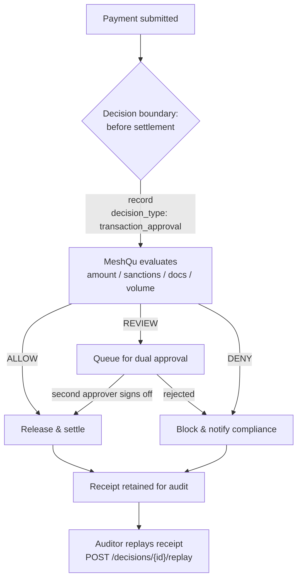

**Audience:** engineers building payment, transfer, or treasury systems who need a policy gate in front of settlement — amount limits, dual-approval thresholds, sanctions and jurisdiction checks, documentation completeness — and a tamper-evident receipt for every approved or rejected transaction.

This recipe is a concrete instance of the synchronous pre-execution and audit patterns in [Integration Patterns](/guides/integration-patterns). It is the canonical "block a transaction and prove it later" flow from [Core Concepts](/concepts/overview#example-blocking-a-trade-and-proving-it-later), wired end to end.

## The scenario

A payment is about to settle. Before it does, your service calls MeshQu at the **decision boundary** — the moment settlement becomes irreversible — with the transaction context. The policy enforces:

- **Amount limits** — over a hard ceiling is `DENY`; over a dual-approval threshold is `REVIEW`.
- **Sanctions & jurisdiction** — source and destination countries must be present and not high-risk.
- **Documentation** — beneficiary details and a transaction reference of sufficient length must be present.
- **Volume controls** — daily volume and transaction-count ceilings flag unusual activity.

MeshQu returns the verdict; your payment rail acts on it. Because settlement is high-stakes and audited, you **record** the decision (not just evaluate it) so there is a durable, replayable receipt.

> **Mental model:** MeshQu does not move money or hold funds. It governs the *approval decision* and hands you a signed verdict. Your payment system is what releases, queues, or blocks the transfer.

<Warning>
  MeshQu is advisory. A `DENY` does not stop the transfer on its own — your settlement code reads the verdict and declines to release the funds. Treat the verdict as the input to your enforcement, never as enforcement itself.
</Warning>

## Decision boundary



Your payment service owns `SETTLE`, `DUAL`, and `BLOCK`. MeshQu owns the `MeshQu evaluates` box and the replay proof.

## Gate and record the transaction

Use **`record`** for settlement decisions — it evaluates *and* persists a signed receipt with an idempotency key, which is exactly what a compliance-critical path needs. (Use the stateless [`evaluate`](/concepts/overview#evaluate-vs-record) only for dry-run testing or non-settling previews.)

<CodeGroup>

```bash cURL
curl -X POST https://api.meshqu.com/v1/decisions/record \
  -H "Authorization: Bearer mqu_YOUR_API_KEY" \
  -H "X-MeshQu-Tenant-Id: YOUR_TENANT_ID" \
  -H "Content-Type: application/json" \
  -d '{
    "context": {
      "decision_type": "transaction_approval",
      "fields": {
        "amount": 18500,
        "currency": "USD",
        "source_country": "US",
        "destination_country": "GB",
        "beneficiary_name": "Meridian Trade Corp",
        "beneficiary_account": "GB29NWBK60161331926819",
        "reference": "INV-88423",
        "daily_volume_usd": 142000,
        "daily_txn_count": 6
      }
    },
    "action": { "type": "payment_execute", "reference_id": "INV-88423" },
    "actor": { "id": "payments-service", "type": "automated", "role": "settlement_engine" },
    "options": { "idempotency_key": "txn-INV-88423" }
  }'
```

```typescript TypeScript
import { MeshQuClient } from '@meshqu/client';

const meshqu = new MeshQuClient({
  baseUrl: 'https://api.meshqu.com',
  tenantId: process.env.MESHQU_TENANT_ID!,
  apiKey: process.env.MESHQU_API_KEY!,
});

async function approveAndSettle(txn: Transaction) {
  const decision = await meshqu.record(
    {
      decision_type: 'transaction_approval',
      fields: {
        amount: txn.amount,                 // > 100000 → DENY, > 50000 → REVIEW (dual approval)
        currency: txn.currency,
        source_country: txn.sourceCountry,
        destination_country: txn.destinationCountry,
        beneficiary_name: txn.beneficiaryName,
        beneficiary_account: txn.beneficiaryAccount,
        reference: txn.reference,           // must be present and long enough
        daily_volume_usd: txn.dailyVolume,
        daily_txn_count: txn.dailyCount,
      },
    },
    {
      idempotency_key: `txn-${txn.reference}`,
      actor: { id: 'payments-service', type: 'automated', role: 'settlement_engine' },
      // action binding is REST-only today — see the cURL tab and the note below
    },
  );

  switch (decision.decision.decision) {
    case 'ALLOW':
      return settle(txn);                                   // your rail releases funds
    case 'REVIEW':
      return queueForDualApproval(txn, decision.decision.id);
    case 'DENY':
      return blockAndNotify(txn, decision.decision.result.violations);
    case 'ALERT':
      // advisory policy would have denied — log and settle
      logger.warn({ decisionId: decision.decision.id }, 'advisory alert on settlement');
      return settle(txn);
  }
}
```

</CodeGroup>

Binding `action: { type: "payment_execute", reference_id: "INV-88423" }` ties the receipt to the specific payment it authorized — the action `type` and `reference_id` are bound into the integrity hash, so the receipt proves *this approval was for this transfer*. See [Integrity & Hashing](/concepts/integrity).

<Note>
  Pass `action` at the **top level** of the record request body, as the cURL tab shows. The early-access TypeScript client does not yet forward `action`, so use the REST API directly when you need action binding — another reason the REST API is the primary integration surface.
</Note>

## Dual approval on `REVIEW`

A transaction over the dual-approval threshold returns `REVIEW`. Hold it, collect a second approver, then record what happened as a [decision outcome](/concepts/overview#decision-outcome) — naming the human who approved it:

```bash
curl -X POST https://api.meshqu.com/v1/decisions/DECISION_ID/outcome \
  -H "Authorization: Bearer mqu_YOUR_API_KEY" \
  -H "X-MeshQu-Tenant-Id: YOUR_TENANT_ID" \
  -H "Content-Type: application/json" \
  -d '{
    "status": "accepted",
    "final_action": "ALLOW",
    "source_type": "human",
    "reported_by": "treasury-approver-2",
    "resolution_reason": "Second approver verified beneficiary and released the transfer."
  }'
```

The verdict (`REVIEW`) and the human resolution (`accepted`, who, why) are now both on the record. One outcome per decision; it is immutable once written.

## Prove it later

Months on, an auditor can pull any approval and **replay** it against the exact policy snapshot that governed it — no access to your application or database required:

```bash
curl -X POST https://api.meshqu.com/v1/decisions/DECISION_ID/replay \
  -H "Authorization: Bearer mqu_YOUR_API_KEY" \
  -H "X-MeshQu-Tenant-Id: YOUR_TENANT_ID"
```

`replay` re-evaluates the original context against the pinned snapshot and returns `matches: true` when the integrity hashes agree — proving the verdict was not altered. List approvals with `GET /v1/decisions?decision_type=transaction_approval&decision=DENY` for a clean denials report.

## Operational notes

- **Idempotency is mandatory on settlement** — a retried `record` with the same `idempotency_key` returns the original receipt (`is_new: false`), never a duplicate approval. Key it on the transaction reference. See [Idempotency](/guides/idempotency).
- **Tighten a limit safely** — lowering a threshold or adding a jurisdiction can wrongly block real payments on day one. Introduce it in `shadow_mode` so its `DENY` is surfaced as `ALERT` while you watch real traffic, then promote. See [Shadow Mode](/guides/shadow-mode).
- **Page on blocked transactions** — subscribe a [webhook](/guides/webhooks) filtered to `transaction_approval` at `severity_min: critical` so compliance is notified the moment a sanctioned-jurisdiction or over-limit transfer is denied.
- **Fail-closed** — for settlement, default to blocking when MeshQu is unreachable. See [fail-open vs fail-closed](/guides/integration-patterns#fail-open-vs-fail-closed).

## Concept references

- [Integration Patterns](/guides/integration-patterns) — the pre-execution gate, record-for-audit, and failure strategy.
- [Core Concepts — Evaluate vs Record](/concepts/overview#evaluate-vs-record) — why settlement uses `record`.
- [Integrity & Hashing](/concepts/integrity) — the integrity hash, action binding, and Ed25519 signature on the receipt.
- [Decision Assurance](/concepts/decision-assurance) — what an auditor can prove offline.
- [Policy Lifecycle](/concepts/policy-lifecycle) — how the approval policy is versioned and ratified.
- [Shadow Mode](/guides/shadow-mode) · [Webhooks](/guides/webhooks).
