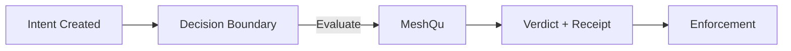

<Info>
  MeshQu is not yet publicly available. The API and SDK are in **early access**. To request access, contact [contact@meshqu.com](mailto:contact@meshqu.com).
</Info>

**Audience:** These docs are for engineers integrating MeshQu into regulated or audit-sensitive systems, and for security, risk, and audit teams validating its behaviour.

MeshQu is not intended for feature flagging, application permissions, or consumer-facing rule evaluation.

MeshQu provides governance infrastructure for automated and AI-assisted decisions that must follow explicit policy. Integrate MeshQu into your application to evaluate transactions, operations, or events against configurable policies and receive structured decisions.

> **Mental model:** MeshQu sits at the decision boundary. You send context, it returns a governed verdict and a verifiable receipt. You own enforcement.

## Why MeshQu exists

Automated and AI-assisted systems make decisions constantly. Few can prove those decisions followed policy at the moment they mattered.

Logs show what happened. They do not prove policy compliance.

MeshQu closes that gap. It makes decisions governable, replayable, and independently verifiable — at the decision boundary.

**Key concepts:** [Decision context](concepts/overview#decision-context) · [Policy](concepts/overview#policy) · [Decision](concepts/overview#decision) · [Alert](concepts/overview#alert)

## What MeshQu does

You send a **decision context** (the data describing what is about to happen). MeshQu evaluates it against your active **policies** and returns a **decision**: `ALLOW`, `REVIEW`, `DENY`, or `ALERT`, along with any violations.

Your application decides what to do with the decision. MeshQu does not block or allow anything on its own — it provides the verdict and your code acts on it.



> If you remember one thing: MeshQu is called **at the decision boundary**, not after.

**Advisory by design:** MeshQu returns a governed verdict and receipt. Enforcement always remains in your system.

```bash
curl -X POST https://api.meshqu.com/v1/decisions/evaluate \
  -H "Authorization: Bearer YOUR_API_KEY" \
  -H "X-MeshQu-Tenant-Id: YOUR_TENANT_ID" \
  -H "Content-Type: application/json" \
  -d '{
    "context": {
      "decision_type": "trade_execution",
      "fields": { "account_id": "ACC-001", "instrument": "AAPL", "quantity": 100 }
    }
  }'
```

```json
{
  "result": {
    "decision": "ALLOW",
    "violations": [],
    "rules_evaluated": 3
  }
}
```

<Warning>
  **MeshQu is advisory by design.** It returns a verdict — your application decides whether to proceed, queue, or block. MeshQu never enforces outcomes on its own.
</Warning>

<Info>
  **Evaluate vs Record** — `evaluate` is fast, stateless, nothing stored. `record` persists the result for audit. Most production systems use `evaluate` on the hot path and `record` for compliance-critical actions. See [Evaluate vs Record](concepts/overview#evaluate-vs-record).
</Info>

## What happens after you integrate

1. Your system calls MeshQu before or after the **decision boundary** — the moment an outcome becomes irreversible.
2. MeshQu evaluates the context against your active policies and returns a verdict and a cryptographic receipt.
3. Your code decides how to act — proceed, queue for review, or block.
4. Auditors can independently replay and verify any recorded decision later.

## Key capabilities

| Capability | Description |
| --- | --- |
| **Policy evaluation** | Evaluate a context against one or many policies in a single call. |
| **Decision recording** | Persist evaluation results for audit and compliance. |
| **Idempotent recording** | Supply an `idempotency_key` to safely retry without duplicate records. |
| **Alert webhooks** | Receive real-time notifications when alerts are raised. |
| **Multi-tenant** | Every request is scoped to a tenant via the `X-MeshQu-Tenant-Id` header. |
| **Scoped API keys** | Fine-grained access control with per-key scopes. |
| **Advisory mode** | Safely test new policies in production; violations generate alerts but do not block traffic. |

## Quick links

- [Quickstart](getting-started/quickstart) — make your first API call in minutes.
- [Authentication](getting-started/authentication) — how API keys and scopes work.
- [API Reference](api/reference) — full endpoint listing.
- [TypeScript SDK](sdk/typescript) — install and use the client library.
- [Integration Patterns](guides/integration-patterns) — common ways to wire MeshQu into your stack.

## Base URLs

| Environment | URL |
| --- | --- |
| Production | `https://api.meshqu.com` |
| Staging | `https://api-staging.meshqu.com` |
| Local dev | `http://localhost:3010` |

All endpoints are prefixed with `/v1`.

## OpenAPI

A machine-readable OpenAPI 3.0 spec is available at:

```
GET /openapi.json
```

Interactive Swagger UI is available at `/docs` when enabled.

---

<Info>
  This Mintlify documentation is the canonical, up-to-date reference. GitBook mirrors public-facing content.
</Info>
